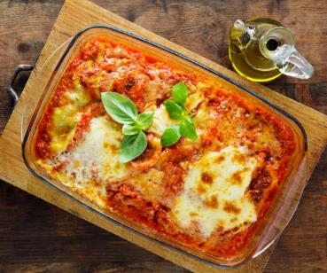

## Ingrediënten

300 gr. verse rabarber

1 perssinaasappel

50 gr kristalsuiker

250 gr. aardbeien

250 gr. mascarpone

125 ml. verse slagroom

½ roombotercake

6 el. aardbeienlikeur

## Benodigdheden

## Bereiding

Snijd de rabarber in stukjes van 2 cm. Rasp de oranje schil van de sinaasappel en pers de vrucht uit. Breng de rabarber met het sap en de helft van de suiker op laag vuur aan de kook. Laat met de deksel op de pan ca. 15 min. koken. Laat afkoelen.

Bewaar 4 aardbeien als garnering. Verwijder de kroontjes van de rest van de aardbeien en snijd deze doormidden. Roer de mascarpone los in een kom en meng met het sinaasappelrasp en de rest van de suiker.

Klop de slagroom stijf en spatel door de mascarpone.

Snijd de cake in 4 plakken en bedek de bodem van de glazen ermee. Verdeel de aardbeienlikeur, de aardbeien, de rabarber en de mascarpone erover. Laat minstens 1 uur in de koelkast opstijven. Garneer met een aardbei.

## Tips

In plaats van roombotercake kan je ook verkruimelde koekjes als bodem gebruiken. En een andere likeur als sinaasappel- of cassislikeur is natuurlijk ook mogelijk.
